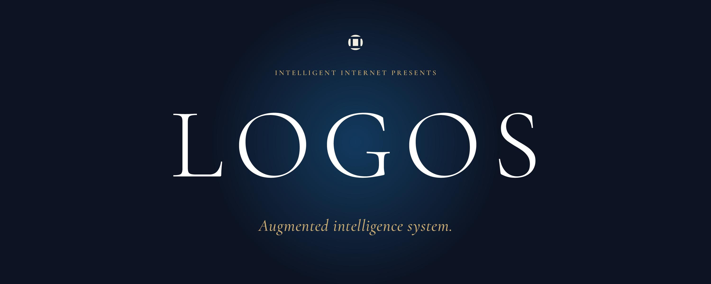
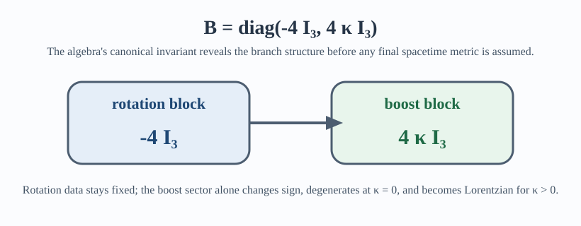
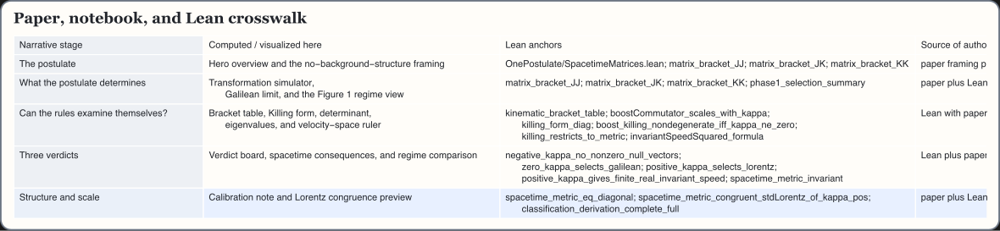

# One Postulate

Einstein used one postulate too many. The relativity principle alone yields a one-parameter family of kinematic universes indexed by `kappa`; the algebra's own built-in measuring tool, the Killing form, rules out the Euclidean and Galilean branches as fundamental; and experiment calibrates the invariant speed instead of positing it. This repository is the formal verification companion to the paper [*One Postulate*](paper/one-postulate.pdf): the paper states the argument, [Lean 4](https://lean-lang.org/) supplies proof authority for the exact algebraic claims, and the Wolfram and SymPy notebooks make the story explorable.

<p align="center">
  <a href="https://github.com/Intelligent-Internet/ii-logos-one-postulate/actions/workflows/lean-ci.yml"></a>
  <a href="paper/one-postulate.pdf"></a>
  <a href="https://colab.research.google.com/github/Intelligent-Internet/ii-logos-one-postulate/blob/20d1c36ae43bdf8d0dcbb80b498ae188157383eb/one_postulate_sympy_colab.ipynb">
    
  </a>
  <a href="docs/notebooks.md"></a>
  <a href="documentation.md#using-external-opengauss"></a>
  <a href="https://aristotle.harmonic.fun/"></a>
  <a href="https://ii.inc"></a>
  <a href="https://ii.inc/web/blog/post/logos"></a>
  <a href="https://op.ii.inc/"></a>
  <a href="https://agent.ii.inc"></a>
  <a href="https://discord.gg/yDWPsshPHB"></a>
  <a href="LICENSE"></a>
</p>

<p align="center">
  
</p>
<p align="center">
  <sub>LOGOS is the public-facing presentation surface for the One Postulate project.</sub>
</p>
<p align="center">
  <sub><strong>Observation tells us the value of the speed. The mathematics tells us that the speed must exist.</strong></sub>
</p>

## Einstein Needed One, Not Two

- `The extra postulate was never the foundation.` Einstein's second postulate was not false; on this paper's reading, it was the measured consequence of a deeper symmetry argument that had not yet been finished.
- `A single number opens three possible universes.` `kappa` labels the available kinematics, and its sign decides whether you get Newton's world, Einstein's, or no causal order at all.
- `Only one universe carries its own speed limit.` In the surviving `kappa > 0` branch, the transformations come with an invariant speed `V = 1 / sqrt(kappa)`, which experiment then measures in nature.

## Release Status

This is a formal verification companion to the paper, not a standalone physics package. Lean 4 is the proof authority for the six-generator special-relativity branch-selection argument. Wolfram and SymPy are explanatory, symbolic, and presentation companions; they are useful for exploration, but they do not replace the Lean proof surface.

Cloud publishing is supported by [`wolfram/cloud_export_notebook.wl`](wolfram/cloud_export_notebook.wl), but it is a publishing action: it requires a local Wolfram runtime and an authenticated Wolfram Cloud account. It is not part of the default local verification path. The repository now uses a split public license: code surfaces are under Apache 2.0, and paper/documentation surfaces are under CC BY 4.0.

The public SymPy notebook is smoke-tested in GitHub Actions with `python -m nbconvert --execute`. The Colab links are pinned to a stable published revision rather than `main`; once the repository has a public release tag, those links should move from the pinned commit to that tag.

## Choose Your Path

- `General reader:` Read [Why this matters](#why-this-matters), [Which Universe Survives?](#which-universe-survives), and [What the Algebra Gives, What Experiment Gives](#what-the-algebra-gives-what-experiment-gives).
- `Formal verifier:` Start with [`paper/one-postulate.pdf`](paper/one-postulate.pdf), then [docs/proof-visuals.md](docs/proof-visuals.md), then [`OnePostulate.lean`](OnePostulate.lean) and [`OnePostulateFull.lean`](OnePostulateFull.lean).
- `Notebook explorer:` Use the Colab notebook above or open [`wolfram/notebooks/one_postulate_explainer.nb`](wolfram/notebooks/one_postulate_explainer.nb), then see [docs/notebooks.md](docs/notebooks.md) for workflow details.
- `Maintainer or publisher:` Use [Build and repository map](#build-and-repository-map), [License, Citation, and Contributions](#license-citation-and-contributions), and [docs/notebooks.md](docs/notebooks.md) before cutting a public release.

## Why this matters

Special relativity is usually taught as beginning with two principles:

1. The laws of physics take the same form in all inertial frames.
2. Light travels at the same finite speed in every inertial frame.

The first is a symmetry statement. The second is an empirical statement about one physical phenomenon. The paper asks whether that second statement really had to sit in the foundations.

In the late nineteenth century, that second postulate looked unavoidable. Sound travels relative to air. Water waves travel relative to water. Light was expected to travel relative to an aether, and the Michelson-Morley null result made that picture unstable without yet explaining what should replace it. Einstein's 1905 move was to elevate that empirical crisis into a principle: light itself would supply the invariant speed.

Einstein's whole career was a campaign against things put in by hand. Special relativity removed absolute simultaneity. General relativity removed privileged coordinate systems. But the invariant speed of light still entered as a physical fact attached to one phenomenon, and in 1905 that looked like the price of getting the transformations at all. If the foundational principle is really frame-independence, then the symmetry rules ought to be able to diagnose their own geometry.

This repository's central claim is that they can. If the paper is right, special relativity is more self-contained than Einstein himself could show in 1905: the relativity principle already determines what kind of spacetime is possible, and experiment is only needed to read off the number. The second postulate was not false. It was redundant: a measured fact promoted to an axiom before the symmetry argument had been completed.

## The Assumption That Wasn't Needed

Rather than start with light and derive Lorentzian kinematics from it, the paper starts with the relativity principle together with the standard assumptions of homogeneity, isotropy, and group composition. Those assumptions lead to the familiar one-parameter family

$$
t' = \gamma (t - \kappa v x), \qquad
x' = \gamma (x - vt), \qquad
\gamma = \frac{1}{\sqrt{1 - \kappa v^2}}.
$$

The paper also changes the level of attack. Coordinate-transformation derivations treat a frame change as a general map and then recover linearity, reciprocity, continuity, and isotropy one condition at a time. The Lie algebra route starts closer to the symmetry itself: write down the generators, compute their brackets, and let the algebra package the regularity structure from the start.

This is the family found in the one-postulate derivations going back to Ignatowski (1910), sharpened later by [Bacry and Levy-Leblond (1968)](https://www.osti.gov/biblio/4838778), Levy-Leblond (1976), Mermin (1984), [Pal (2003)](https://arxiv.org/abs/physics/0302045), and [Anker and Ziegler (2020)](https://arxiv.org/abs/2007.09301). What those derivations leave open is the sign and physical meaning of `kappa`.

The paper's move is to stop where that literature stopped and then go one step further. First classify the possible universes. Then ask whether the algebra can examine itself and select among them. That is where the Killing form becomes decisive.

## Three Possible Universes

Once `kappa` appears, three broad possibilities open up. `kappa` is best read as a single dial controlling what kind of universe you get. Turn it one way and you get Einstein's universe. Leave it at zero and you get Newton's. Turn it the other way and you get a world with no causal order at all.

| Branch | What the transformations describe | What kind of spacetime it gives |
| --- | --- | --- |
| `kappa < 0` | Boosts behave like rotations in a compact geometry | Euclidean four-geometry with no lightcones and no causal distinction between past and future |
| `kappa = 0` | The mixing of space into time disappears | Galilean kinematics with absolute time, no invariant speed, and no unified spacetime metric |
| `kappa > 0` | Space and time mix with a finite limiting speed | Lorentzian spacetime with lightcones, causality, and a real invariant speed |

The standard historical conclusion is that the first postulate alone reaches this three-way fork but cannot decide among the branches. The paper's claim is stronger: once the algebra is allowed to test its own internal structure, only one branch remains compatible with the symmetry principle as a foundational statement.

## The Algebra Examines Itself

The homogeneous kinematics algebra has six generators: three rotations `J_i` and three boosts `K_i`. The paper studies how those generators reshuffle one another under the adjoint action and then applies the algebra's canonical invariant:

$$
B(X,Y) = \mathrm{tr}(\mathrm{ad}_X \circ \mathrm{ad}_Y).
$$

For the `kappa`-family, the result is

$$
B = \mathrm{diag}(-4 I_3,\; 4 \kappa I_3).
$$

That single matrix is the pivot of the argument.

In plain language, the Killing form is the algebra's built-in measuring device. You do not bolt it on later. Every Lie algebra comes with it automatically. When it is non-degenerate, it can distinguish all the directions that matter. When it degenerates, it develops a blind spot.

- The rotation block is always nonzero.
- The boost block is controlled entirely by `kappa`.
- When the boost block vanishes, the algebra is blind to exactly the operations that relate one inertial frame to another.

That last point is why `degenerate` matters here. It does not mean "messy" or "bad" in a vague sense. It means the built-in measuring device fails on a specific sector of generators the theory is supposed to compare. In the Galilean case, the blind spot lands on the boosts, which are the generators of changes of velocity. The symmetry can still talk about inertial frames, but it can no longer fully measure the geometry relating them.

<p align="center">
  
</p>
<p align="center">
  <sub>The repository's computational companion makes the same pivot visible: compute the invariant first, then read geometry from it.</sub>
</p>

This is why the Killing form is not an ornamental calculation in the paper. It is the mechanism that tells us whether the symmetry rules can generate their own geometry or whether some part of spacetime has been left as unexplained background structure.

## Which Universe Survives?

**Option 1: `kappa < 0` — the Euclidean universe**

When `kappa` is negative, the Killing form is nondegenerate everywhere, but its signature no longer separates boosts from rotations in the way a causal spacetime requires. The resulting group is compact. There is no lightcone structure, no intrinsic distinction between temporal and spatial directions, and no causal ordering of events. The branch is internally coherent, but it does not generate a spacetime in which cause and effect can be defined.

Verdict: rejected. A universe without causality is not a universe with physics in the ordinary sense.

**Option 2: `kappa = 0` — the Galilean universe**

When `kappa = 0`, the Killing form vanishes on every boost. The boost sector still has shape, but it has no intrinsic ruler. Velocity space has symmetry without a preferred scale, there is no invariant speed, and time survives as fixed background structure rather than being generated by the symmetry. On the paper's reading, this is the difference between the same form of equations and the same laws in full content: the equations can still look symmetric, but the algebra no longer fixes the ruler needed to make frame-to-frame comparisons fully determinate. This is why the paper treats Galilean mechanics not as a rival foundation but as a singular limit of the Lorentzian case.

Verdict: rejected. The relativity principle was supposed to make the framework self-contained, but here the algebra cannot finish the job without outside help.

**Option 3: `kappa > 0` — the Lorentzian universe**

When `kappa` is positive, every generator remains visible to the algebra's self-test. The boost sector acquires a definite scale, the invariant speed is finite and real, and spacetime carries a Lorentzian metric rather than separate external notions of space and time. This is the only branch that both preserves causal structure and eliminates background scaffolding.

Verdict: accepted. This is the only branch where the relativity principle is fully implemented rather than partially described.

The paper's comparison table can be read directly from that split:

| Question | `kappa < 0` | `kappa = 0` | `kappa > 0` |
| --- | --- | --- | --- |
| Killing form on boosts | Negative | Zero | Positive |
| Invariant speed | Imaginary | Undefined | Finite and real |
| Spacetime metric | Euclidean | `dt^2` only | Lorentzian |
| Causal structure | None | None | Lightcones |
| Space-time unification | All four directions alike | Impossible | Complete |
| Background structure needed | None | Yes | None |

### The Punchline

1. The relativity principle is the sole postulate.
2. It generates a one-parameter family of possible kinematics, indexed by `kappa`.
3. Every Lie algebra comes with a built-in invariant, the Killing form, for free.
4. At `kappa <= 0`, the self-test fails in one of two ways: either causality disappears or the algebra goes blind on the boost sector.
5. At `kappa > 0`, the self-test remains fully functional: it produces a Lorentzian metric, unifies space and time, and guarantees a finite invariant speed.
6. Therefore a finite, real, universal speed limit is not an empirical bolt-on. Observation determines the value. The algebra determines the existence.

## What the Algebra Gives, What Experiment Gives

The argument does **not** determine the numerical value of the invariant speed. It determines that such a speed must exist.

That is the paper's distinction between structure and calibration:

- `What the algebra gives:` `kappa > 0`, a finite invariant speed, and Lorentzian spacetime with lightcones.
- `What experiment gives:` the numerical value `c ≈ 299,792,458 m/s` and the empirical fact that light in vacuum travels at that speed.
- Measuring `c` tells us that `kappa = 1 / c^2`.

If relativity is really a ban on background structure, then the framework has to generate its own ruler. That is the force of the paper's distinction between structure and calibration: a self-contained theory should not need to import the existence of the ruler from one special phenomenon and only then announce that every observer must respect it.

This is why the paper's closing claim is so sharp: the speed's value is empirical; its existence is not.

Nothing in the physics changes if this argument is right. The Lorentz transformations stay the same. The predictions stay the same. What changes is the logical architecture: special relativity becomes leaner, more self-contained, and closer to Einstein's own instinct that deep theories should not rely on background structure smuggled in by hand.

The broader explainer connected to this repository pushes that architectural point further into familiar special-relativistic language: once the Lorentzian branch is fixed, later structures such as four-vector organization and covariant field formulations look less like extra decoration and more like downstream consequences of the same symmetry logic. In this repository, that broader payoff is context rather than proof surface: the formalized claim stops at branch selection and the existence of a finite invariant speed.

## Formal verification

The repository formalizes the paper's exact algebraic spine in Lean 4 with Mathlib. The proof development is matrix-first: it writes down explicit generators, proves the bracket table, computes the Killing form, and only then reads off the spacetime consequences.

The boundary matters. The current proof surface is the six-generator homogeneous special-relativity argument: rotations, boosts, the `kappa`-family, the Killing-form split, and the Lorentzian branch-selection result. The notebooks are explanatory and computational companions. Broader guide material is useful context, but it is not this repository's proof authority.

| Surface | Role | Authority |
| --- | --- | --- |
| [`paper/one-postulate.tex`](paper/one-postulate.tex) and [`paper/one-postulate.pdf`](paper/one-postulate.pdf) | Narrative arc, claim ordering, physical interpretation | Paper |
| [`OnePostulate.lean`](OnePostulate.lean) | Guarded exact proof surface | Lean proof authority |
| [`OnePostulateFull.lean`](OnePostulateFull.lean) | Full-paper root including the deferred classification bridge | Lean proof authority |
| [`wolfram/notebooks/one_postulate_explainer.nb`](wolfram/notebooks/one_postulate_explainer.nb) and [`one_postulate_sympy_colab.ipynb`](one_postulate_sympy_colab.ipynb) | Symbolic checks, diagrams, and interactive explanation | Computed here, not proof authority |

The main Lean modules line up with the paper's stages:

| Lean surface | What it covers |
| --- | --- |
| [`OnePostulate/SpacetimeMatrices.lean`](OnePostulate/SpacetimeMatrices.lean) and [`OnePostulate/KinematicAlgebra.lean`](OnePostulate/KinematicAlgebra.lean) | Explicit generators, bracket table, Jacobi identity |
| [`OnePostulate/KillingForm.lean`](OnePostulate/KillingForm.lean) | `B = diag(-4 I_3, 4 kappa I_3)` and the boost-sector split |
| [`OnePostulate/VelocitySpace.lean`](OnePostulate/VelocitySpace.lean) and [`OnePostulate/SpacetimeRepresentation.lean`](OnePostulate/SpacetimeRepresentation.lean) | Velocity-space metric behavior, spacetime metric invariance, Galilean reducibility, Lorentzian congruence |
| [`OnePostulate/Selection.lean`](OnePostulate/Selection.lean) and [`OnePostulate/ClassificationDerivation.lean`](OnePostulate/ClassificationDerivation.lean) | The branch verdicts and the deferred full-paper classification bridge |

For a deeper walkthrough of the proof spine, see [docs/proof-visuals.md](docs/proof-visuals.md). For notebook workflow, assets, and presentation guidance, see [docs/notebooks.md](docs/notebooks.md).

## Explore It for Yourself

The repository includes two computational companions. If you do not want to start with Lean, these notebook surfaces are the easiest way in.

- Primary public-facing notebook: [`wolfram/notebooks/one_postulate_explainer.nb`](wolfram/notebooks/one_postulate_explainer.nb), generated from [`wolfram/build_one_postulate_notebook.wl`](wolfram/build_one_postulate_notebook.wl)
- Secondary notebook: [`one_postulate_sympy_colab.ipynb`](one_postulate_sympy_colab.ipynb) [](https://colab.research.google.com/github/Intelligent-Internet/ii-logos-one-postulate/blob/20d1c36ae43bdf8d0dcbb80b498ae188157383eb/one_postulate_sympy_colab.ipynb)

<p align="center">
  
</p>
<p align="center">
  <sub>The notebook surfaces mirror the paper's rhetorical order while keeping Lean as the proof boundary.</sub>
</p>

If you want the full proof path, use this order:

1. Start with the paper: [`paper/one-postulate.pdf`](paper/one-postulate.pdf)
2. Use the proof guide: [docs/proof-visuals.md](docs/proof-visuals.md)
3. Open the notebook guide: [docs/notebooks.md](docs/notebooks.md)
4. Explore the Wolfram or SymPy companion
5. Drop into [`OnePostulate.lean`](OnePostulate.lean) if you want the exact proof surface

## The Long Road to One Postulate

The README follows the paper's claim, but the background story is the long road to the missing sign of `kappa`: first the transformation equations, then the one-postulate family, and then a century-long stall over which branch actually survives.

| Year | Reference | Role in this repository's story |
| --- | --- | --- |
| 1888 | Wilhelm Killing, *Die Zusammensetzung der stetigen endlichen Transformationsgruppen* | Introduces the Killing form that becomes the paper's decisive self-test |
| 1895 | Hendrik Lorentz, transformation equations | Gets the transformation equations in pre-relativistic form, still tied to the ether picture |
| 1904 | Henri Poincare, Lorentz group structure | Recognizes the group structure that later algebraic derivations make central |
| 1905 | [Albert Einstein, *On the Electrodynamics of Moving Bodies*](https://en.wikisource.org/wiki/On_the_Electrodynamics_of_Moving_Bodies_%281920_edition%29) | States the two-postulate presentation of special relativity |
| 1910 | W. von Ignatowski, *Einige allgemeine Bemerkungen uber das Relativitatsprinzip* | Shows that the relativity principle already leads to a one-parameter kinematic family |
| 1921 | Wolfgang Pauli, *Theory of Relativity* | Canonical early statement that `kappa` cannot be fixed without experiment |
| 1968 | [H. Bacry and J.-M. Levy-Leblond, *Possible Kinematics*](https://www.osti.gov/biblio/4838778) | Classifies the possible kinematic groups and sharpens the one-parameter picture |
| 1976 | J.-M. Levy-Leblond, *One More Derivation of the Lorentz Transformation* | Classic pedagogical statement of how far the first postulate goes before branch selection |
| 1984 | N. David Mermin, *Relativity Without Light* | Clear modern presentation of the one-postulate tradition that this paper tries to complete |
| 2003 | [P. B. Pal, *Nothing but Relativity*](https://arxiv.org/abs/physics/0302045) | Modern derivation of Lorentz transformations without assuming light at the start |
| 2015 | [A. Drory, *The necessity of the second postulate in special relativity*](https://arxiv.org/abs/1412.4018) | Frames the modern debate over how much the second postulate contributes physically |
| 2020 | [J.-P. Anker and F. Ziegler, *Relativity without light: A new proof of Ignatowski's theorem*](https://arxiv.org/abs/2007.09301) | Shows the one-postulate route remains mathematically active and technically fertile |

This repository's contribution is not another derivation of the `kappa` family. Its claim is that the family's internal invariant already chooses the physically acceptable branch.

Separate follow-on work explores extending the same method beyond the six-generator homogeneous algebra to translation-extended kinematics. That is adjacent to this repository, not inside it: no GR-style, cosmological-constant, or translation-sector claims are part of the current Lean proof surface here. Within the broader four-paper program, this repository is the part that asks whether even the invariant speed can be removed from the axioms.

## Build and repository map

Run commands from the repository root. Lean verification is the default reproducibility path. Wolfram commands require a local Wolfram runtime; Cloud publishing additionally requires an authenticated Wolfram Cloud account.

### Verify the Lean proof

```bash
lake build
lake env lean OnePostulate/ClassificationDerivation.lean
lake env lean OnePostulateFull.lean
rg -n 'sorry|admit' OnePostulateFull.lean OnePostulate.lean OnePostulate/*.lean
```

### Regenerate notebook assets

```bash
wolframscript -file wolfram/build_one_postulate_notebook.wl
```

### Publish Wolfram notebook to Cloud

This is a release/publishing action, not a default local build step.

```bash
wolframscript -file wolfram/cloud_export_notebook.wl
```

Key repository surfaces:

```text
paper/                    Paper source and PDF
OnePostulate/             Lean proof modules
OnePostulate.lean         Guarded exact root
OnePostulateFull.lean     Full-paper root
docs/proof-visuals.md     Proof-map and theorem spine
docs/notebooks.md         Notebook workflow and asset guide
wolfram/                  Notebook builder, generated notebook, SVG previews, CloudExport script
one_postulate_sympy_colab.ipynb   Secondary SymPy companion
```

## License, Citation, and Contributions

License: this repository uses a split license described in [`LICENSE`](LICENSE).
Code surfaces such as Lean proofs, Wolfram scripts, Python notebooks, and build infrastructure are licensed under [`LICENSES/LICENSE-CODE`](LICENSES/LICENSE-CODE) (Apache 2.0). Paper and documentation surfaces such as [`paper/`](paper), [`docs/`](docs), [`README.md`](README.md), [`blueprint/`](blueprint), and the SVG assets are licensed under [`LICENSES/LICENSE-DOCS`](LICENSES/LICENSE-DOCS) (CC BY 4.0).

Repository SPDX expression: `Apache-2.0 AND CC-BY-4.0`.

Citation: repository-level citation metadata is provided in [`CITATION.cff`](CITATION.cff). For scientific use, cite the paper first and this repository as the formal verification companion.

Contributions: see [`CONTRIBUTING.md`](CONTRIBUTING.md). This repository is not yet treating issues and pull requests as the primary scientific review surface; focused fixes to links, documentation clarity, rendering, or reproducibility are the safest contribution shape.

## References

- Emad Mostaque (2026), [*One Postulate*](paper/one-postulate.pdf)
- [Albert Einstein (1905/1920 translation), *On the Electrodynamics of Moving Bodies*](https://en.wikisource.org/wiki/On_the_Electrodynamics_of_Moving_Bodies_%281920_edition%29)
- Wilhelm Killing (1888), *Die Zusammensetzung der stetigen endlichen Transformationsgruppen*
- W. von Ignatowski (1910), *Einige allgemeine Bemerkungen uber das Relativitatsprinzip*
- Wolfgang Pauli (1921/1958), *Theory of Relativity*
- [H. Bacry and J.-M. Levy-Leblond (1968), *Possible Kinematics*](https://www.osti.gov/biblio/4838778)
- J.-M. Levy-Leblond (1976), *One More Derivation of the Lorentz Transformation*
- N. David Mermin (1984), *Relativity Without Light*
- [P. B. Pal (2003), *Nothing but Relativity*](https://arxiv.org/abs/physics/0302045)
- [A. Drory (2015), *The necessity of the second postulate in special relativity*](https://arxiv.org/abs/1412.4018)
- [J.-P. Anker and F. Ziegler (2020), *Relativity without light: A new proof of Ignatowski's theorem*](https://arxiv.org/abs/2007.09301)

## How to Cite

- Paper: Mostaque, Emad. 2026. [*One Postulate*](paper/one-postulate.pdf).
- Repository: Mostaque, Emad. 2026. [*One Postulate*](https://github.com/Intelligent-Internet/ii-logos-one-postulate). Formal verification companion repository. See [`CITATION.cff`](CITATION.cff).

For any questions, please reach out to [Rish](https://notirshabh.fr): [rishabh@ii.inc](mailto:rishabh@ii.inc).
