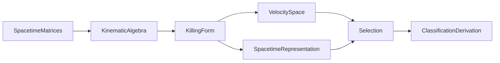
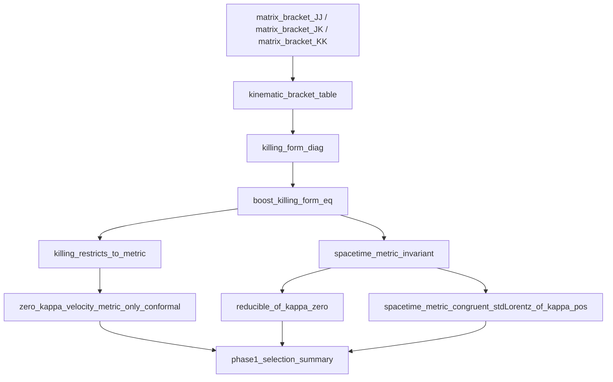
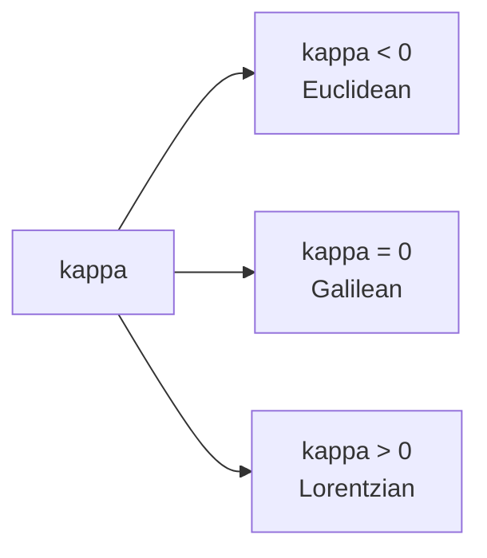
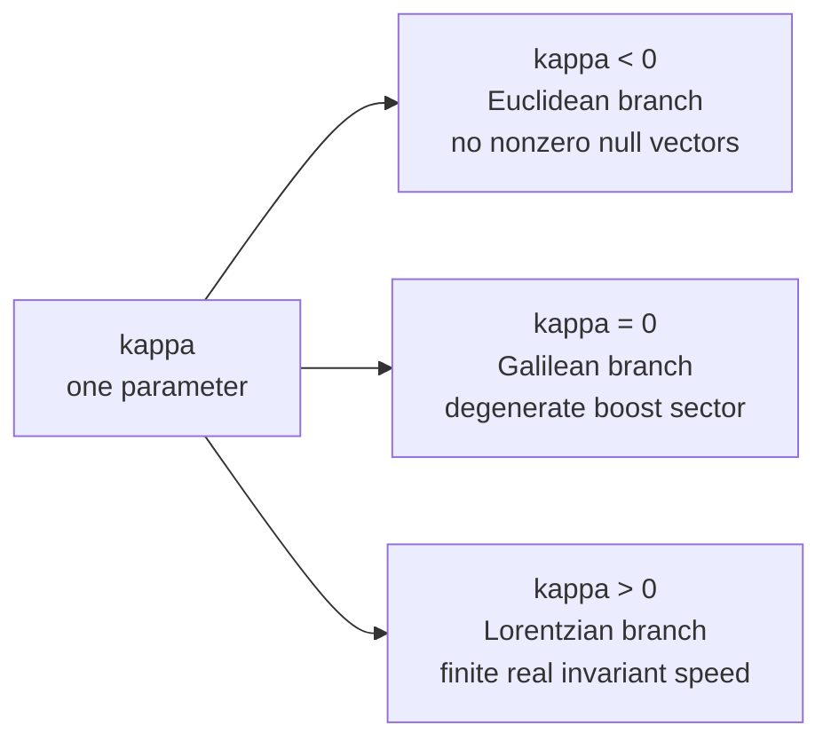
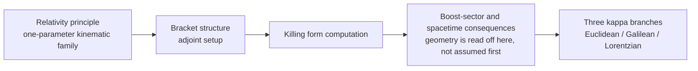
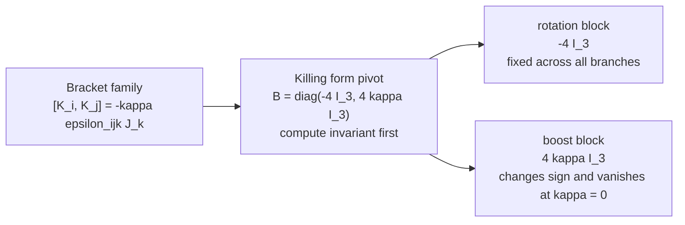
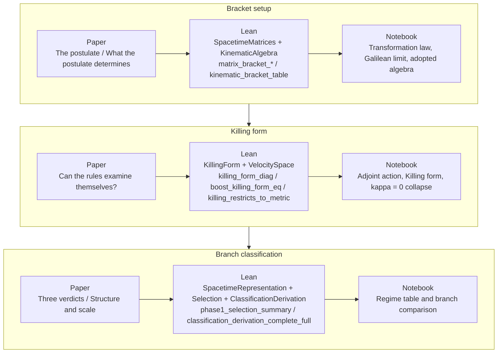
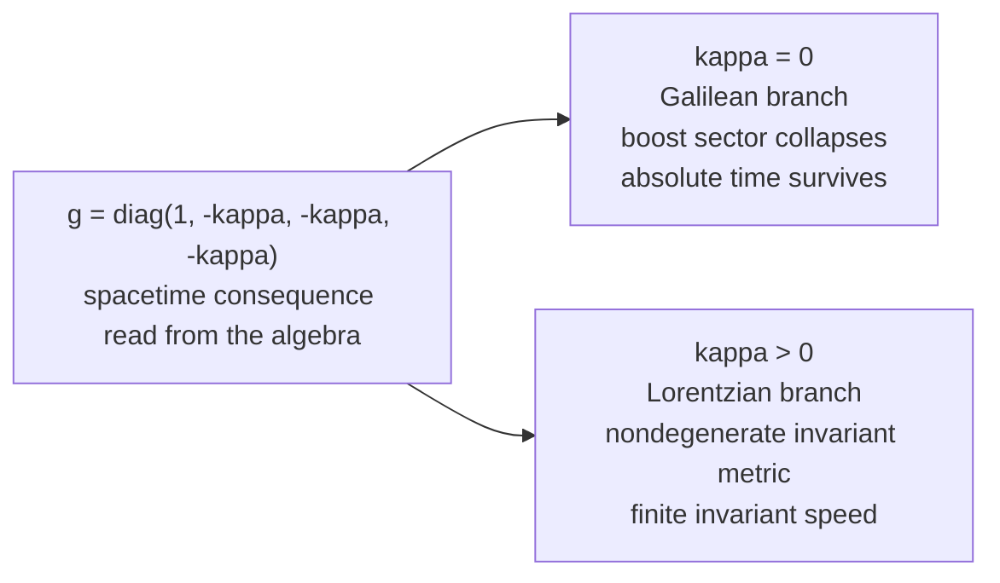

# One Postulate Lean

`one-postulate-lean` is a Lean 4 + Mathlib formalization of the argument in *One Postulate*: starting from the relativity principle and a one-parameter kinematic family indexed by `κ`, the repository derives the homogeneous bracket structure, computes the Killing form, and separates the Euclidean, Galilean, and Lorentzian branches in a matrix-first proof development. The paper in [`paper/one-postulate.tex`](paper/one-postulate.tex) states the narrative, Lean supplies the proof authority, the Wolfram workbook at [`wolfram/notebooks/one_postulate_explainer.nb`](wolfram/notebooks/one_postulate_explainer.nb) is now the primary public-facing computational companion, and the SymPy notebook remains a secondary explainer.

## At a Glance

- The formal development is organized around `κ`, which controls the boost-boost commutator and therefore the kinematic branch.
- The Lean spine starts with explicit matrices, proves the bracket table, computes the Killing form, and only then reads off metric consequences.
- The decisive invariant is the Killing form:
  `diag(-4 I_3, 4 κ I_3)` in the ordered `(Jx, Jy, Jz, Kx, Ky, Kz)` basis.
- The Wolfram workbook is built from [`wolfram/build_one_postulate_notebook.wl`](wolfram/build_one_postulate_notebook.wl), documented in [docs/notebooks.md](docs/notebooks.md), and intended as the primary public-facing computational companion; [`one_postulate_sympy_colab.ipynb`](one_postulate_sympy_colab.ipynb) remains available as a secondary explainer.
- The three branches are formalized explicitly:
  - `κ < 0`: Euclidean branch, no nonzero null vectors
  - `κ = 0`: Galilean branch, degenerate boost sector, invariant absolute-time direction
  - `κ > 0`: Lorentzian branch, nondegenerate invariant metric, finite real invariant speed
- The guarded root is [`OnePostulate.lean`](OnePostulate.lean); the full-paper root is [`OnePostulateFull.lean`](OnePostulateFull.lean).

## Visual Proof Map









## Why the Killing Form Matters



The argument does not assume the final spacetime metric first and then check it later. It computes the algebra's canonical invariant, shows how the boost block scales with `κ`, and then reads geometry from that result. The Wolfram workbook is organized around the same pivot: exact symbolic calculations are there to make the invariant visible, not to replace Lean. A fuller walkthrough lives in [docs/proof-visuals.md](docs/proof-visuals.md).



## Paper <-> Lean <-> Notebook



| Paper idea | Lean proof surface | Computational companion |
| --- | --- | --- |
| `The postulate` / `What the postulate determines` | [`OnePostulate/SpacetimeMatrices.lean`](OnePostulate/SpacetimeMatrices.lean), [`OnePostulate/KinematicAlgebra.lean`](OnePostulate/KinematicAlgebra.lean), `matrix_bracket_*`, `kinematic_bracket_table` | [`wolfram/notebooks/one_postulate_explainer.nb`](wolfram/notebooks/one_postulate_explainer.nb) opening sections on the transformation law, Galilean limit, and adopted algebra; [docs/notebooks.md](docs/notebooks.md) explains the workflow; [`one_postulate_sympy_colab.ipynb`](one_postulate_sympy_colab.ipynb) remains secondary |
| `Can the rules examine themselves?` | [`OnePostulate/KillingForm.lean`](OnePostulate/KillingForm.lean), [`OnePostulate/VelocitySpace.lean`](OnePostulate/VelocitySpace.lean), `killing_form_diag`, `boost_killing_form_eq`, `killing_restricts_to_metric` | Wolfram workbook middle sections on adjoint action, the Killing form, and the `κ = 0` collapse, with the exact build path in [`wolfram/build_one_postulate_notebook.wl`](wolfram/build_one_postulate_notebook.wl) |
| `Three verdicts` / `Structure and scale` | [`OnePostulate/SpacetimeRepresentation.lean`](OnePostulate/SpacetimeRepresentation.lean), [`OnePostulate/Selection.lean`](OnePostulate/Selection.lean), [`OnePostulate/ClassificationDerivation.lean`](OnePostulate/ClassificationDerivation.lean) | Wolfram workbook regime table and branch comparison cells, with a secondary crosswalk visual at [`wolfram/assets/notebook_preview_crosswalk.svg`](wolfram/assets/notebook_preview_crosswalk.svg) |

### What Is Computed Here vs Proved in Lean

The Wolfram workbook is a computational companion, not a proof-assistant notebook. It evaluates exact formulas and visualizes the branch split; Lean remains the proof authority.

| Narrative stage | Computed / visualized here | Lean anchors | Source of authority |
| --- | --- | --- | --- |
| Transformation law and `κ -> 0` limit | exact Wolfram limits and the one-parameter law | [`matrix_bracket_JJ`](OnePostulate/SpacetimeMatrices.lean), [`matrix_bracket_JK`](OnePostulate/SpacetimeMatrices.lean), [`matrix_bracket_KK`](OnePostulate/SpacetimeMatrices.lean) | paper + Lean |
| Kinematic bracket family | bracket table and matrix-form inspection | [`kinematic_bracket_table`](OnePostulate/KinematicAlgebra.lean), [`kinematic_bracket_jacobi`](OnePostulate/KinematicAlgebra.lean), [`boostCommutator_scales_with_kappa`](OnePostulate/KinematicAlgebra.lean) | Lean |
| Killing form pivot | exact block-matrix computation | [`killing_form_diag`](OnePostulate/KillingForm.lean), [`boost_killing_form_eq`](OnePostulate/KillingForm.lean), [`boost_killing_nondegenerate_iff_kappa_ne_zero`](OnePostulate/KillingForm.lean) | Lean |
| Branch consequences | regime table and summary panels | [`killing_restricts_to_metric`](OnePostulate/VelocitySpace.lean), [`zero_kappa_velocity_metric_only_conformal`](OnePostulate/VelocitySpace.lean), [`spacetime_metric_eq_diagonal`](OnePostulate/SpacetimeRepresentation.lean), [`phase1_selection_summary`](OnePostulate/Selection.lean), [`classification_derivation_complete`](OnePostulate/ClassificationDerivation.lean), [`classification_derivation_complete_full`](OnePostulate/ClassificationDerivation.lean) | paper + Lean |



For the deeper walkthrough, see [docs/proof-visuals.md](docs/proof-visuals.md), the notebook guide in [docs/notebooks.md](docs/notebooks.md), the Wolfram workbook at [`wolfram/notebooks/one_postulate_explainer.nb`](wolfram/notebooks/one_postulate_explainer.nb), and the secondary SymPy notebook at [`one_postulate_sympy_colab.ipynb`](one_postulate_sympy_colab.ipynb) [](https://colab.research.google.com/drive/1QicnUoHA3gSGQjb5NJxH09PDSXWZb8tr?usp=sharing).

## Formalization and Validation Story

This repository is not only a Lean formalization of the paper. It is also set up to be checked by external autoformalization and theorem-proving tooling. The core proof remains the local Lean code, but the surrounding validation story is now part of the public record.

- Lean formalization:
  the repository formalizes the matrix-first spine of the paper, from the bracket table and Killing form through the `κ < 0`, `κ = 0`, and `κ > 0` branch split.
- Aristotle by Harmonic:
  the external prover is documented in the repository as a second prover and checker, and Harmonic describes Aristotle as a system that combines formal verification with informal reasoning in Lean ([arXiv](https://arxiv.org/abs/2510.01346), [Harmonic PDF](https://harmonic.fun/pdf/Aristotle_IMO_Level_Automated_Theorem_Proving.pdf)).
- OpenGauss / Gauss by Math, Inc.:
  the repository includes project-scoped Gauss configuration in [`.gauss/project.yaml`](.gauss/project.yaml), and Math, Inc. describes OpenGauss as an open-source, state-of-the-art autoformalization harness for Lean and Gauss as its frontier autoformalization agent ([OpenGauss](https://www.math.inc/opengauss), [Gauss](https://www.math.inc/gauss)).

### What The Formalization Covers

- Main imported surface:
  explicit generators, `matrix_bracket_*`, `kinematic_bracket_table`, the explicit Killing form, the boost-sector metric, the invariant spacetime form, and the phase-1 branch split.
- Full-paper surface:
  the deferred classification bridge in [`OnePostulate/ClassificationDerivation.lean`](OnePostulate/ClassificationDerivation.lean), kept separate from the guarded root [`OnePostulate.lean`](OnePostulate.lean).
- Public branch summary:
  `κ < 0` gives the Euclidean branch, `κ = 0` the Galilean branch, and `κ > 0` the Lorentzian branch with a finite real invariant speed.

### What The Verification Summaries Say

- Main-surface Aristotle validation:
  the archived run in [docs/aristotle/runs/483c60fc-d712-4426-b086-30bf99699fa2/ARISTOTLE_SUMMARY_483c60fc-d712-4426-b086-30bf99699fa2.md](docs/aristotle/runs/483c60fc-d712-4426-b086-30bf99699fa2/ARISTOTLE_SUMMARY_483c60fc-d712-4426-b086-30bf99699fa2.md) reports a clean main-surface build, no `sorry`s, standard axioms only, and no mismatches against [`paper/one-postulate.tex`](paper/one-postulate.tex).
- Full-paper Aristotle validation:
  the archived run in [docs/aristotle/runs/e6639ca2-b91a-4b73-aa99-780e921628ab/ARISTOTLE_SUMMARY_e6639ca2-b91a-4b73-aa99-780e921628ab.md](docs/aristotle/runs/e6639ca2-b91a-4b73-aa99-780e921628ab/ARISTOTLE_SUMMARY_e6639ca2-b91a-4b73-aa99-780e921628ab.md) reports no mismatches for [`OnePostulateFull.lean`](OnePostulateFull.lean) and [`OnePostulate/ClassificationDerivation.lean`](OnePostulate/ClassificationDerivation.lean), with the main import boundary preserved.
- OpenGauss status in this repository:
  the repository is configured for project-scoped OpenGauss use and interactive autoformalization workflows, but the tracked validation archive in this checkout is Aristotle-centered rather than a committed OpenGauss run report.

## How to Read This Repo

- General audience:
  start with [`paper/one-postulate.pdf`](paper/one-postulate.pdf), skim the diagrams and preview assets above, then open [docs/notebooks.md](docs/notebooks.md) and the Wolfram workbook at [`wolfram/notebooks/one_postulate_explainer.nb`](wolfram/notebooks/one_postulate_explainer.nb).
- Math reader:
  read [`paper/one-postulate.tex`](paper/one-postulate.tex), then [docs/proof-visuals.md](docs/proof-visuals.md), then the dependency ledger in [`blueprint/src/content.tex`](blueprint/src/content.tex).
- Lean reader:
  begin at [`OnePostulate.lean`](OnePostulate.lean), follow the module order shown in the proof map, and use [`OnePostulateFull.lean`](OnePostulateFull.lean) only when you want the deferred classification bridge.

## Build and Validation

```bash
lake build
lake env lean OnePostulate/ClassificationDerivation.lean
lake env lean OnePostulateFull.lean
rg -n 'sorry|admit' OnePostulateFull.lean OnePostulate.lean OnePostulate/*.lean
wolframscript -file wolfram/build_one_postulate_notebook.wl
```

For repository-specific workflow notes and archived review runs, see [docs/aristotle/README.md](docs/aristotle/README.md). For project-scoped Gauss/OpenGauss setup, see [documentation.md](documentation.md). For the Wolfram notebook workflow, preview assets, and share/present notes, see [docs/notebooks.md](docs/notebooks.md).

## Repo Status

- Proof authority lives in the local paper and Lean files, not in the README or notebooks.
- The guarded import boundary is preserved:
  [`OnePostulate.lean`](OnePostulate.lean) does not import `OnePostulate.ClassificationDerivation`.
- The full-paper bridge remains separate in [`OnePostulateFull.lean`](OnePostulateFull.lean).
- Public-facing Wolfram notebooks and SVG previews now live under the canonical [`wolfram/`](wolfram/) paths.
- Public-facing visuals and notebooks are intended to make the argument easier to read, not to widen the formal surface.
- External validation story:
  Aristotle run summaries are archived in-tree; OpenGauss is configured in-tree, but this checkout does not currently archive a dedicated OpenGauss validation report.

## TODO Checklist

- [ ] Add D3 and SVG animations.
- [x] Expand Wolfram/Mathematica simulations and Observable D3.
- [ ] Map to interactive website experience.
- [ ] Add license and attribution.
- [ ] Add backlinks to II website + blogs.
- [ ] Add social buttons to README.
- [ ] Human factors and editorial on README content.
- [x] 2026-03-31 `6b6fa14`: Upgrade the Wolfram notebook workflow, canonical `wolfram/` asset paths, and public docs. Present on `mathematica-sympy-one-postulate`.
- [x] 2026-03-30 `91880ef`: Fix Mermaid labels so GitHub renders the proof diagrams correctly. Current branch only.
- [x] 2026-03-30 `fae4848`: Refresh the public docs and notebook surfaces, including the landing-page README, proof visuals, notebook guide, Wolfram companion notebook, and preview assets. Current branch only.
- [x] 2026-03-29 `46309e7`: Archive Aristotle validation bundles as tracked tarballs. Present only on `origin/aristotle-one-postulate`.
- [x] 2026-03-29 `04b2de7` / `9b8d8b8`: Add a paper-aligned narrative to the SymPy notebook. Shared across the SymPy, Aristotle, and current branch lines.
- [x] 2026-03-28 `3d819f2`: Rewrite the README as a narrative overview. Shared across the docs-oriented branch lines.
- [x] 2026-03-28 `11d7901`: Update the paper and archive the current Aristotle validation runs.
- [x] 2026-03-28 `ca63e19`: Archive the Aristotle main-surface validation run.
- [x] 2026-03-27 `33b22f1`: Archive the Aristotle full-paper validation run.
- [x] 2026-03-27 `a872df5`: Improve the README documentation.
- [x] 2026-03-27 `7e604b9`: Add repository-specific Aristotle documentation.
- [x] 2026-03-27 `176dd3e`: Add the full-paper `OnePostulateFull` surface and the deferred classification bridge.
- [x] 2026-03-27 `7c22460`: Close out the phase-1 branch guards and validation hardening docs.
- [x] 2026-03-26 `b67c260`: Complete the phase-1 formal fixes.
- [x] 2026-03-26 `5c83dca`: Repair the phase-1 Lean surface baseline.
