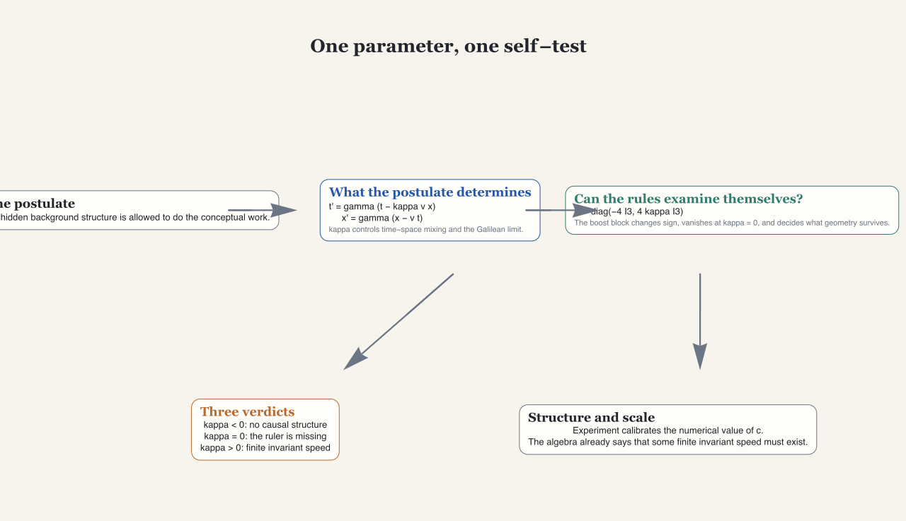
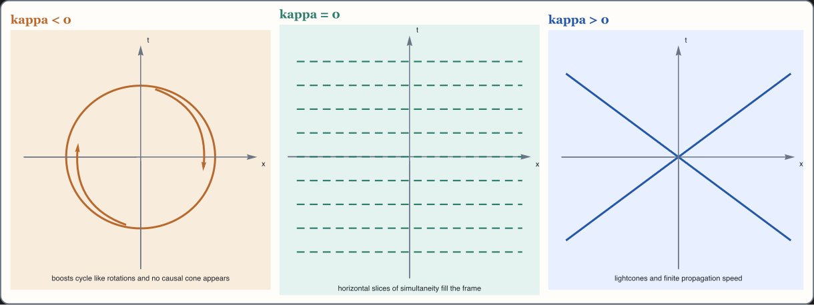
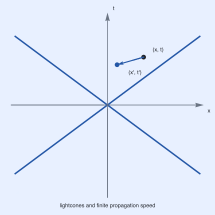

# Notebook Companions

This repository exposes two computational surfaces alongside the Lean proof.
They are companions to the paper, not replacements for it.

- Primary public-facing Wolfram workbook: [`wolfram/notebooks/one_postulate_explainer.nb`](../wolfram/notebooks/one_postulate_explainer.nb)
- Secondary SymPy explainer: [`one_postulate_sympy_colab.ipynb`](../one_postulate_sympy_colab.ipynb)

## What The Notebooks Do

The notebooks make the paper's symbolic calculations easier to inspect. They
do not widen the proof surface and they do not replace the Lean files as the
repository's proof authority.

### Wolfram workbook

[`wolfram/notebooks/one_postulate_explainer.nb`](../wolfram/notebooks/one_postulate_explainer.nb)
is the primary public-facing computational companion. It is generated from
[`wolfram/build_one_postulate_notebook.wl`](../wolfram/build_one_postulate_notebook.wl)
and follows the frozen structure in
[`wolfram/notebook_plan.md`](../wolfram/notebook_plan.md).

- It now follows the paper's rhetorical flow:
  - `The postulate`
  - `What the postulate determines`
  - `Can the rules examine themselves?`
  - `Three verdicts`
  - `Structure and scale`
- It contains one shared exploration suite with:
  - continuous `kappa`
  - a velocity slider
  - a draggable event `(x, t)`
  - tabbed views for `Transformation`, `Killing form`, `Velocity space`, and
    `Verdict`
- It keeps the proof boundary visible with inline badges for:
  - computed here
  - paper narrative
  - Lean proof anchor
- It is generated from source, so the notebook can be rebuilt reproducibly.

### SymPy notebook

[`one_postulate_sympy_colab.ipynb`](../one_postulate_sympy_colab.ipynb) remains
available as a secondary companion.

The public Colab link for that notebook is intentionally pinned to a stable
published revision rather than `main`. Once the repository has a public
release tag, that pinned revision should be updated to the tag.

- It starts from the already-derived `1+1` transformation law.
- It checks the Galilean limit `kappa -> 0` directly.
- It adopts the homogeneous kinematics algebra used later in the paper.
- It computes the Killing form and compares the `kappa < 0`, `kappa = 0`, and
  `kappa > 0` regimes symbolically.
- It separates direct symbolic checks from the paper's higher-level physical
  reading.
- It is smoke-tested in GitHub Actions with `python -m nbconvert --execute`.

## Lean Crosswalk

| Narrative stage | Computed / visualized here | Lean anchors | Source of authority |
| --- | --- | --- | --- |
| The postulate | hero overview and the no-background-structure framing | `matrix_bracket_JJ`, `matrix_bracket_JK`, `matrix_bracket_KK` | Local paper + Lean |
| What the postulate determines | transformation simulator, exact `kappa -> 0` limit, and Figure 1 regime view | `matrix_bracket_JJ`, `matrix_bracket_JK`, `matrix_bracket_KK`, `phase1_selection_summary` | Local paper + Lean |
| Can the rules examine themselves? | bracket family, Killing form, determinant, eigenvalues, and velocity-space ruler | `kinematic_bracket_table`, `kinematic_bracket_jacobi`, `boostCommutator_scales_with_kappa`, `killing_form_diag`, `boost_killing_form_eq`, `boost_killing_nondegenerate_iff_kappa_ne_zero`, `killing_restricts_to_metric`, `invariantSpeedSquared_formula` | Local paper + Lean |
| Three verdicts | verdict board, spacetime consequences, and regime comparison | `negative_kappa_no_nonzero_null_vectors`, `negative_kappa_selects_euclidean`, `zero_kappa_selects_galilean`, `positive_kappa_selects_lorentz`, `positive_kappa_gives_finite_real_invariant_speed`, `spacetime_metric_invariant`, `phase1_selection_summary` | Local paper + Lean |
| Structure and scale | calibration note and Lorentz congruence preview | `spacetime_metric_eq_diagonal`, `spacetime_metric_congruent_stdLorentz_of_kappa_pos`, `classification_derivation_complete`, `classification_derivation_complete_full` | Local paper + Lean |

## Proof Authority

- Computed or symbolically checked in the Wolfram workbook:
  transformation-law limits, the dynamic regime views, the diagonal Killing
  form, determinant and eigenvalue checks, the velocity-space ruler story, the
  verdict board, and the positive-`kappa` Lorentz congruence calculation.
- Formalized in Lean:
  the repository claims exposed through
  [`OnePostulate.lean`](../OnePostulate.lean),
  [`OnePostulateFull.lean`](../OnePostulateFull.lean), and the modules under
  [`OnePostulate/`](../OnePostulate).
- Narrated by the paper:
  [`paper/one-postulate.tex`](../paper/one-postulate.tex).

## Open / Present / Share

From the repository root:

```bash
wolframscript -file wolfram/build_one_postulate_notebook.wl
```

That workflow regenerates the notebook and the canonical preview assets under
`wolfram/assets/`.

- Open the notebook from
  [`wolfram/notebooks/one_postulate_explainer.nb`](../wolfram/notebooks/one_postulate_explainer.nb)
  in a Wolfram notebook-capable environment.
- Use the shared exploration suite to present the paper live: drag the event,
  move `kappa`, adjust `v`, and switch between the transformation, Killing
  form, velocity-space, and verdict tabs.
- Share the static previews on GitHub; they are designed to stand on their own
  outside the notebook.

If your Wolfram setup supports notebook sharing or cloud publishing, use the
generated notebook as the source artifact and keep the exported SVGs as the
GitHub-safe preview layer.

### Publish the Wolfram notebook with `CloudExport`

The repository also includes a publish-only script that uses the notebook file
already checked into the repository. It does not rebuild the notebook first.

```bash
wolframscript -file wolfram/cloud_export_notebook.wl
```

By default, this exports
[`wolfram/notebooks/one_postulate_explainer.nb`](../wolfram/notebooks/one_postulate_explainer.nb)
to the public cloud object `one-postulate/one_postulate_explainer.nb`.

Use command-line arguments to choose a different cloud object path or
permission setting:

```bash
wolframscript -file wolfram/cloud_export_notebook.wl one-postulate/one_postulate_explainer.nb Public
```

The same values can be supplied with environment variables:

```bash
ONE_POSTULATE_CLOUD_OBJECT=one-postulate/one_postulate_explainer.nb \
ONE_POSTULATE_CLOUD_PERMISSIONS=Public \
wolframscript -file wolfram/cloud_export_notebook.wl
```

The script calls `CloudConnect[]` if the local Wolfram session is not already
connected. A Wolfram Cloud account and working Wolfram runtime are required.
The exported cloud notebook is the web-hosted Wolfram surface; the SVG previews
remain the GitHub-safe fallback.

## Preview Assets

The generated preview graphics are suitable for GitHub Markdown:









- [`wolfram/assets/notebook_hero_overview.svg`](../wolfram/assets/notebook_hero_overview.svg)
  - one-parameter story -> self-test -> final verdict
- [`wolfram/assets/notebook_preview_branches.svg`](../wolfram/assets/notebook_preview_branches.svg)
  - the paper's Figure 1 style comparison of the three kinematic universes
- [`wolfram/assets/notebook_preview_killing_form.svg`](../wolfram/assets/notebook_preview_killing_form.svg)
  - the boost-sector sign and degeneracy story
- [`wolfram/assets/notebook_preview_spacetime.svg`](../wolfram/assets/notebook_preview_spacetime.svg)
  - the transformation simulator's default live state
- [`wolfram/assets/notebook_preview_crosswalk.svg`](../wolfram/assets/notebook_preview_crosswalk.svg)
  - the later paper -> notebook -> Lean map
