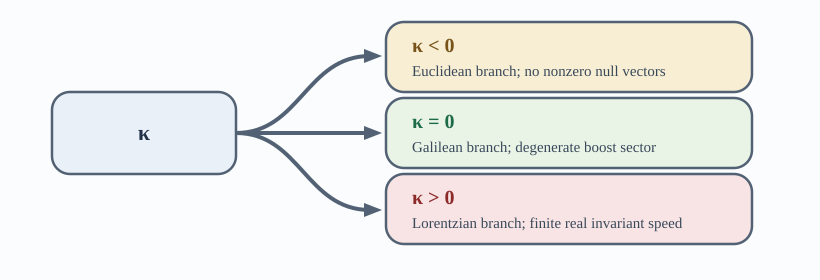
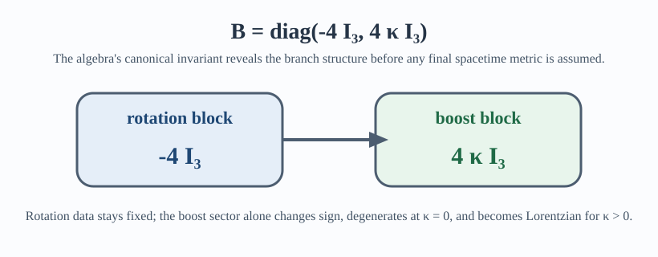
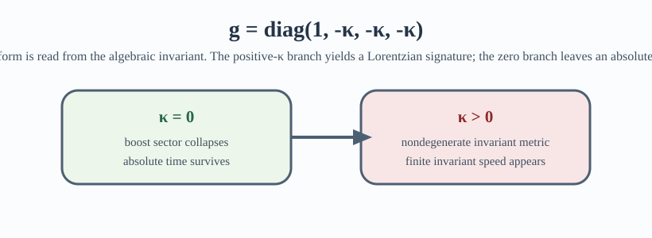

# Notebook Companions

This repository exposes two computational surfaces alongside the Lean proof.
They are companions to the paper, not replacements for it.

- [`one_postulate_sympy_colab.ipynb`](../one_postulate_sympy_colab.ipynb)
- [`notebooks/one_postulate_explainer.nb`](../notebooks/one_postulate_explainer.nb)

## What The Notebooks Do

The notebooks make the paper's symbolic calculations easier to inspect.
They do not widen the proof surface and they do not replace the Lean files as
the repository's proof authority.

### SymPy notebook

[`one_postulate_sympy_colab.ipynb`](../one_postulate_sympy_colab.ipynb) is the
Python-facing explainer.

- It starts from the already-derived `1+1` transformation law.
- It checks the Galilean limit `kappa -> 0` directly.
- It adopts the homogeneous kinematics algebra used later in the paper.
- It computes the Killing form and compares the `kappa < 0`, `kappa = 0`, and
  `kappa > 0` regimes symbolically.
- It separates direct symbolic checks from the paper's higher-level physical
  reading.

### Wolfram notebook

[`notebooks/one_postulate_explainer.nb`](../notebooks/one_postulate_explainer.nb)
is the Wolfram-facing workbook generated from
[`wolfram/build_one_postulate_notebook.wl`](../wolfram/build_one_postulate_notebook.wl).

- It presents the same `kappa`-controlled story in a notebook-native layout.
- It includes both explanatory text and executable code cells.
- It is generated from source, so the notebook can be rebuilt reproducibly.

## Lean Crosswalk

| Notebook topic | Lean surface |
| --- | --- |
| transformation law and `kappa -> 0` limit | [`OnePostulate/SpacetimeMatrices.lean`](../OnePostulate/SpacetimeMatrices.lean) and the paper's `What the postulate determines` section |
| homogeneous bracket family | [`OnePostulate/KinematicAlgebra.lean`](../OnePostulate/KinematicAlgebra.lean), `matrix_bracket_JJ`, `matrix_bracket_JK`, `matrix_bracket_KK`, `kinematic_bracket_table` |
| Killing form computation | [`OnePostulate/KillingForm.lean`](../OnePostulate/KillingForm.lean), `killing_form_diag`, `boost_killing_form_eq` |
| boost-sector metric behavior | [`OnePostulate/VelocitySpace.lean`](../OnePostulate/VelocitySpace.lean), `killing_restricts_to_metric`, `zero_kappa_velocity_metric_only_conformal` |
| spacetime metric and branch selection | [`OnePostulate/SpacetimeRepresentation.lean`](../OnePostulate/SpacetimeRepresentation.lean), [`OnePostulate/Selection.lean`](../OnePostulate/Selection.lean) |

## Proof Authority

- Computed or symbolically checked in the notebooks: formulas already adopted
  there, direct limits, matrix identities, and regime comparisons.
- Formalized in Lean: the repository claims exposed through
  [`OnePostulate.lean`](../OnePostulate.lean),
  [`OnePostulateFull.lean`](../OnePostulateFull.lean), and the modules under
  [`OnePostulate/`](../OnePostulate).
- Narrated by the paper:
  [`paper/one-postulate.tex`](../paper/one-postulate.tex).

## Build The Wolfram Notebook

From the repository root:

```bash
wolframscript -file wolfram/build_one_postulate_notebook.wl
```

With an activated local Wolfram Engine, that script regenerates:

- [`notebooks/one_postulate_explainer.nb`](../notebooks/one_postulate_explainer.nb)
- `docs/assets/notebook_preview_branches.svg`
- `docs/assets/notebook_preview_killing_form.svg`
- `docs/assets/notebook_preview_spacetime.svg`

If `wolframscript` is installed but not yet activated, the committed source files
in this repository still provide the same public-facing notebook structure and
preview assets.

## Preview Assets

The generated preview graphics are lightweight and suitable for GitHub
Markdown:







- `docs/assets/notebook_preview_branches.svg`
- `docs/assets/notebook_preview_killing_form.svg`
- `docs/assets/notebook_preview_spacetime.svg`
