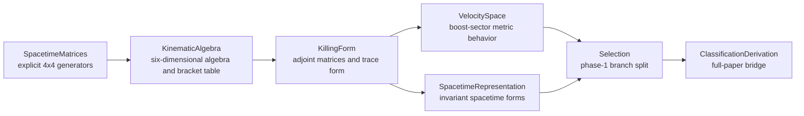
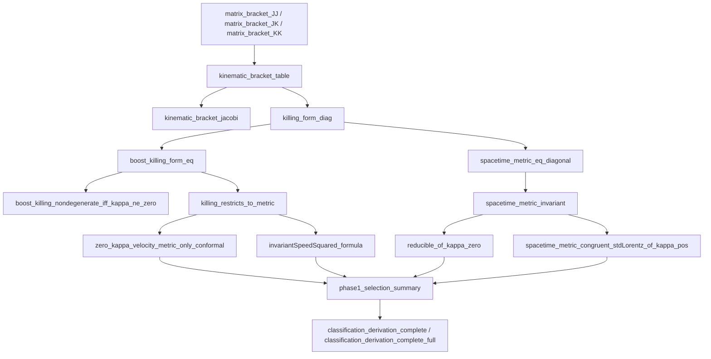
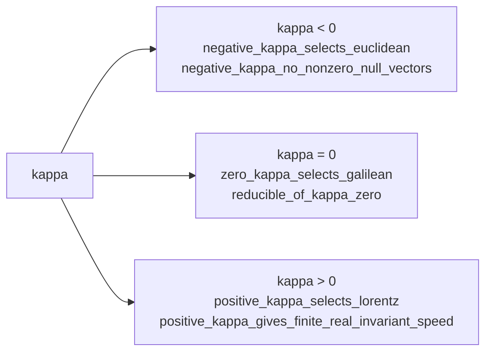
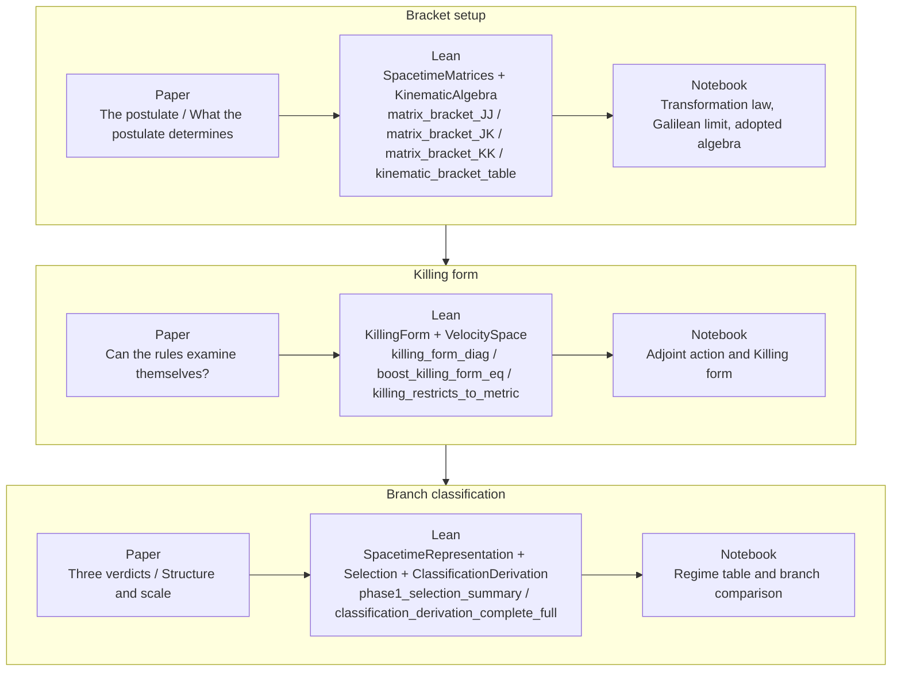

# Proof Visuals

This page expands the proof map from the root README. It is meant for readers who want the public story of the repository without dropping directly into Lean source.

## The Matrix-First Route

The formalization is intentionally concrete.

1. Write down explicit spacetime generators for rotations and boosts.
2. Use those matrices to prove the homogeneous bracket table.
3. Turn the bracket table into an adjoint representation.
4. Compute the Killing form from that adjoint action.
5. Read the boost-sector and spacetime consequences from the resulting invariant form.

That choice matches the paper's local narrative: geometry is recovered from the algebra's own invariant, not imposed first.

## Module Flow

## Theorem Spine

## The Branch Split

## Paper / Lean / Notebook Crosswalk

| Paper section | Lean files and theorems | Notebook surface |
| --- | --- | --- |
| `The postulate` / `What the postulate determines` | [`OnePostulate/SpacetimeMatrices.lean`](../OnePostulate/SpacetimeMatrices.lean), [`OnePostulate/KinematicAlgebra.lean`](../OnePostulate/KinematicAlgebra.lean), `matrix_bracket_JJ`, `matrix_bracket_JK`, `matrix_bracket_KK`, `kinematic_bracket_table` | SymPy opening sections on the transformation law, Galilean limit, and adopted algebra |
| `Can the rules examine themselves?` | [`OnePostulate/KillingForm.lean`](../OnePostulate/KillingForm.lean), [`OnePostulate/VelocitySpace.lean`](../OnePostulate/VelocitySpace.lean), `killing_form_diag`, `boost_killing_form_eq`, `killing_restricts_to_metric` | SymPy middle sections on adjoint action and Killing form |
| `Three verdicts` / `Structure and scale` | [`OnePostulate/SpacetimeRepresentation.lean`](../OnePostulate/SpacetimeRepresentation.lean), [`OnePostulate/Selection.lean`](../OnePostulate/Selection.lean), [`OnePostulate/ClassificationDerivation.lean`](../OnePostulate/ClassificationDerivation.lean), `phase1_selection_summary`, `classification_derivation_complete_full` | SymPy regime table and branch comparison |

## Proof Authority

- The paper is the local source for the narrative claim ordering.
- The Lean files are the proof authority for repository claims.
- The notebook surfaces are computational companions:
  they expose symbolic structure, but they do not replace the Lean proof.
